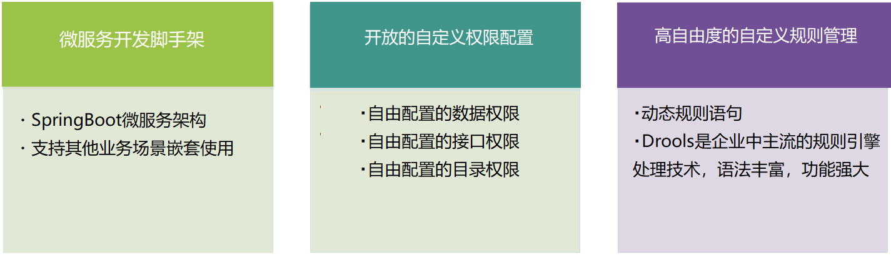
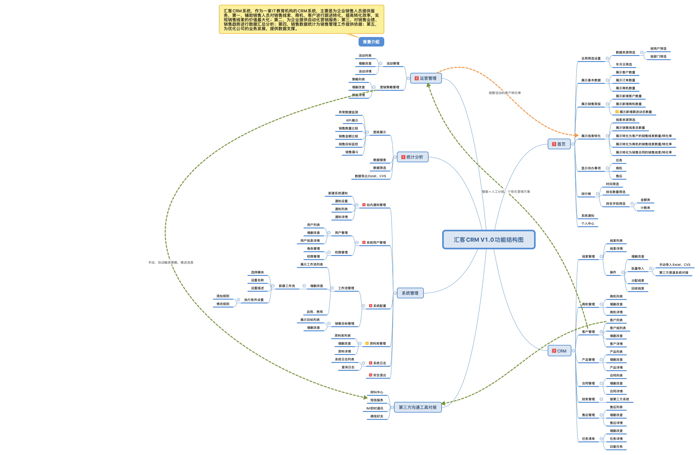
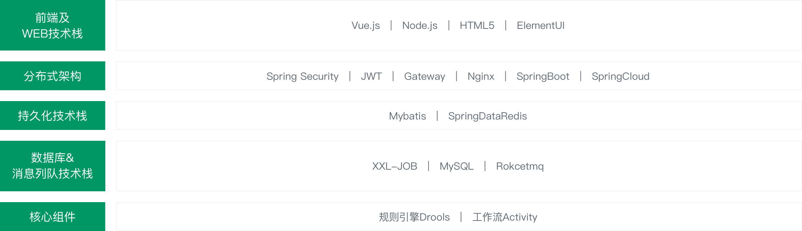
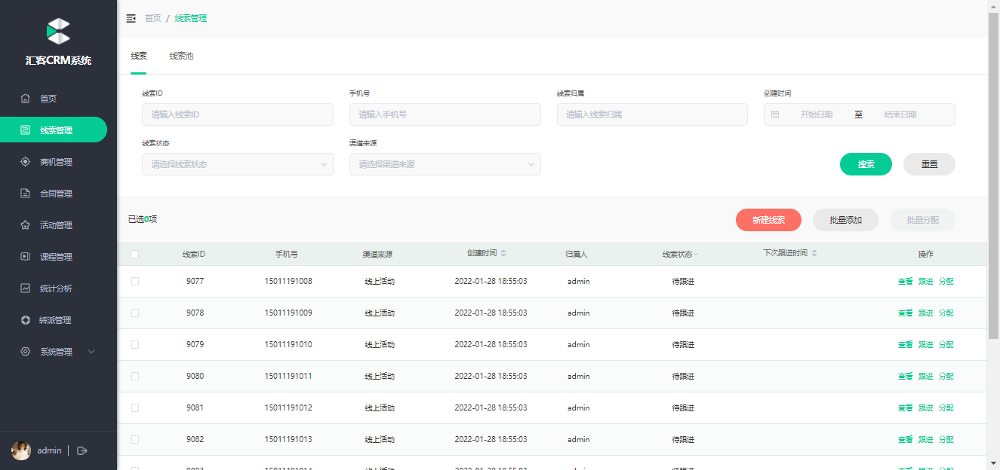
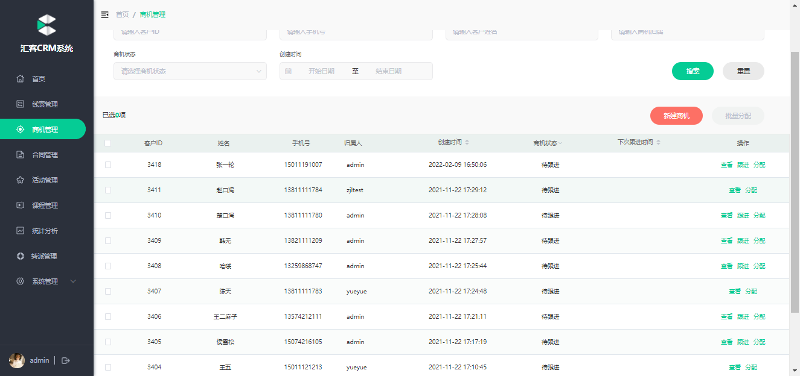
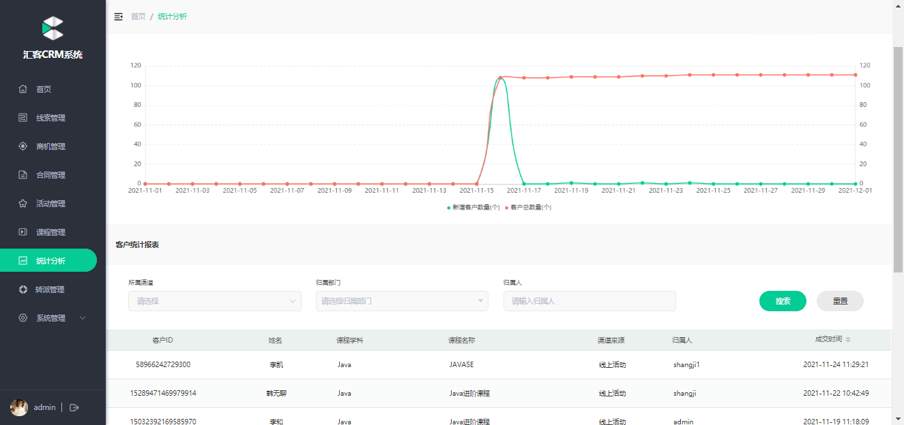
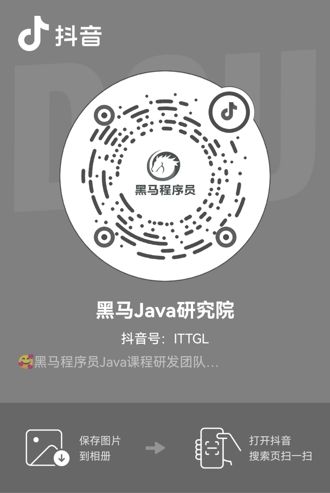

- [后端Gitee地址](https://gitee.com/itcastopen/itcast-authority.git)
- [前端Gitee地址](https://gitee.com/itcastopen/huike-ui)

**在线演示**
=========================
- [官方主页](https://pip.itcast.cn/java-hk)
- [演示地址](http://huike-crm.itheima.net/#/login)

**项目背景**
=========================

- 随着时代的发展，越来越多的国内企业开始采用CRM客户关系管理系统，近年来CRM不仅受到大型企业的青睐，也是中小企业快速成长的催化剂。市场、客户信息、产品、业务人员、渠道等各类信息流的不断增长，传统方式对于管理全渠道信息流成本越来越高，所以需要一个软件产品来解决这些问题。除了这些需求，整个市场各种竞品对于整个消费市场的瓜分，各个软件产品有各自的功能。

  互联网+的出现，改变了很多行业同样很多行业的理念也在转变，伴随着电子商务、智能手机的不断应用，使企业更加简单的接触消费者，直接与消费者互动收集消费者反馈成为可能。那原本以产品以企业为核心的理念逐渐在转变，转变以“客户为中心”，及时服务客户，提高客户满意程度，从而提高企业营收。

  依托强大的信息技术，企业可以借助CRM系统不断把客户跟进，服务，成交，售后打通，而且不断依托CRM工具来优化这个流程。

- [了解更多项目](https://project-dev.itheima.net/java)，改变命运，少走弯路，进入真项目知识海洋畅游。

# 业务介绍

- 我公司作为一家互联网教育机构，在客户关系管理方面面临很多问题，包括：市场部门渠道增多、线索量加大、市场的客户需要客户细分、分配业务人员对于客户信息的跟进信息和记录、管理者对于销售目标的设定、销售计划的统计等。

- 汇客CRM系统，主要是为企业销售人员提供服务以下服务：

1. 辅助销售人员对销售线索、商机、客户进行跟进转化，提高转化效率，实现销售线索的价值最大化；

2. 为企业提供自动化营销服务；

3. 第三，对销售业绩、销售趋势进行数据汇总分析；

4. 第四，销售数据统计为销售管理工作提供依据；

5. 第五，为优化公司的业务发展，提供数据支撑。

# 功能特性

系统架构
=========================

功能结构
=========================

技术架构
=========================

更多流程图
=========================
[全部流程图](docs/img/流程图)

环境要求
=========================
- Node： 14.15+（集成npm）
  https://nodejs.org/en/download
- jdk 1.8+
- mysql 8.0+
- redis 5.6+

- docs/安装手册/install.md)

页面一览
=========================

线索管理

商机管理

统计分析

新的惊喜
=========================
想进步、要关注。关注老铁抖音号，成为'铁丝' ：）

  
加微信、加入Java开源技术交流群
 

  

更多福利
=========================

[了解更多项目](https://pip.itcast.cn/home)